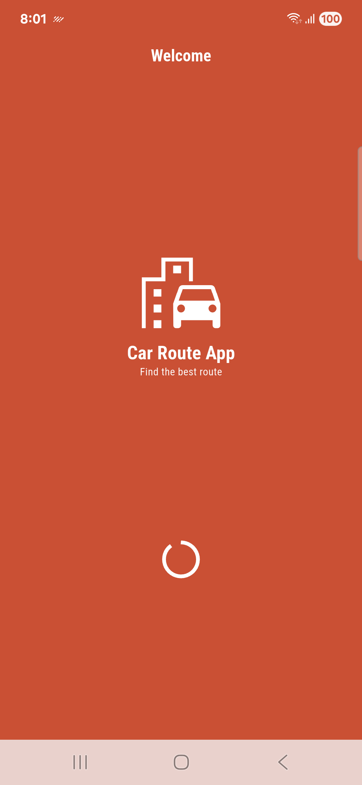
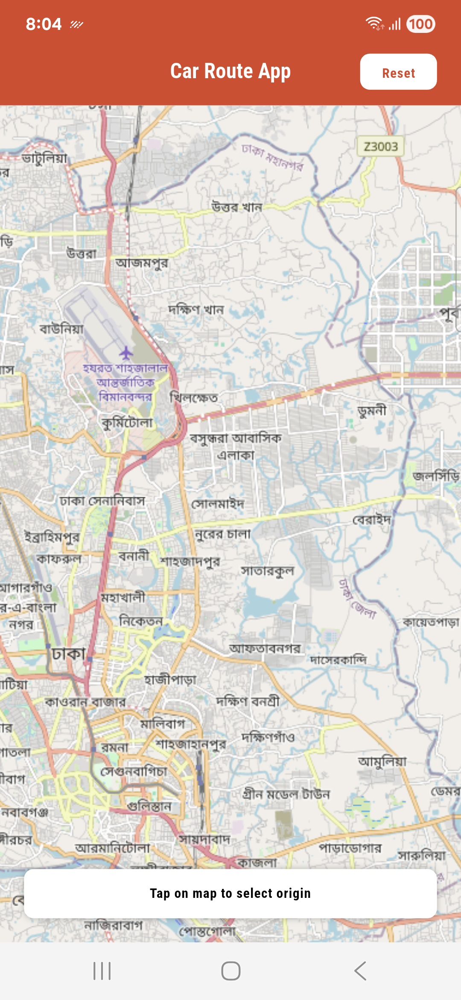
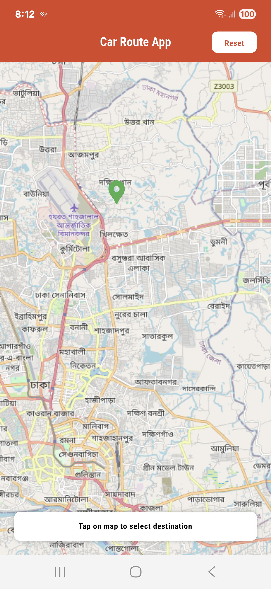
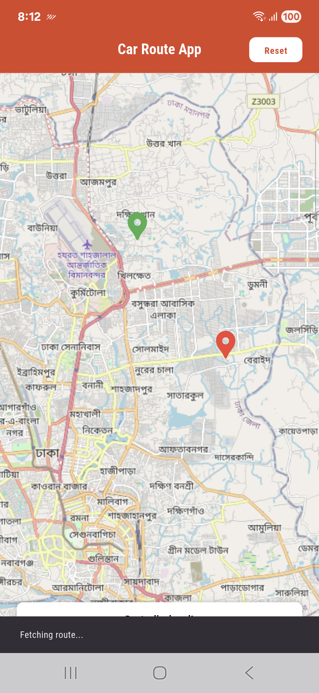
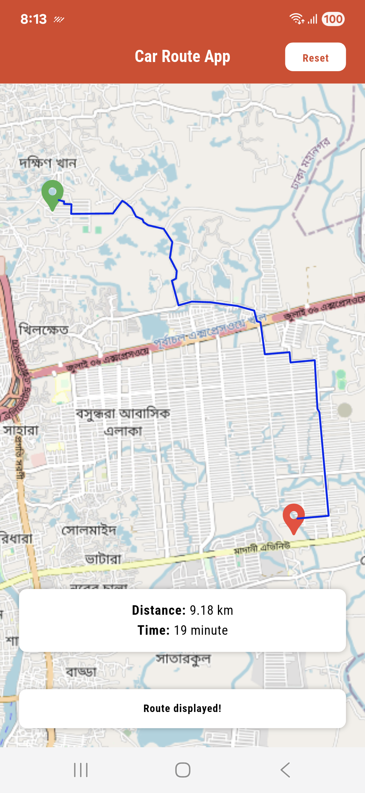

# Car Route App

A simple mobile app to estimate distance, time and find best path to travel via car

## Tools and technologies:

1. Framework: flutter-3.29.2
2. Programming language: dart-3.7.2

## Packages:

1. state management:
    - flutter_bloc: ^9.1.1
2. state object's equality check:
    - equatable: ^2.0.7
3. network related:
    - dio: ^5.9.0
4. map view:
    - flutter_map: ^8.2.2
5. latitude and longitude calculation:
    - latlong2: ^0.9.1

## Installation:

To setup flutter:<br>
Follow the [official guide](https://docs.flutter.dev/get-started/install)

To run this project locally, follow these steps:

1. **Clone the repository**:

  ```bash
  git clone https://github.com/Neloy-SWE/Car-Route-App.git
  ```
2. **Navigate to the project directory(root folder)**:
  ```bash
  cd Car-Route-App
```

3. **Install dependencies**:
  ```bash
  flutter pub get
```

4. **Run the application**:
  ```bash
  flutter run
```

## Project Structure:
  ```bash
├── bloc
│   ├── location
│   │   ├── location_bloc.dart
│   │   ├── location_event.dart
│   │   └── location_state.dart
│   └── route
│       ├── route_bloc.dart
│       ├── route_event.dart
│       └── route_state.dart
├── main.dart
├── network
│   ├── api
│   │   └── direction
│   │       ├── api_call_get_direction.dart
│   │       └── i_api_call_get_direction.dart
│   ├── configuration
│   │   ├── configuration_api_constant.dart
│   │   ├── configuration_exception.dart
│   │   ├── configuration_interceptor.dart
│   │   └── configuration_network.dart
│   ├── model
│   │   └── model_direction.dart
│   └── repository
│       └── route
│           ├── i_route_repository.dart
│           └── route_repository.dart
├── use_case
│   ├── use_case_location_point.dart
│   └── use_case_route_details.dart
├── utilities
│   ├── app_color.dart
│   ├── app_constant.dart
│   ├── app_font.dart
│   ├── app_text.dart
│   └── app_theme.dart
└── view
    └── screen
        ├── screen_map.dart
        └── screen_splash.dart
```

## Overview:

<p float="left">
  

  - splash screen.

<br>
<p float="left">
  

  - map view. user can scroll, zoom in, zoom out, select origin and destination on the map to get route.

<br>
<p float="left">
  
  
  

- after select the origin and destination point on the map, app will generate a route and show it on the map on realtime. using the reset button from the app bar, user can get the initial map view again and use it for any other route.<br><br>
user can also find the distance between two points and estimated time to reach destination.

## Future scopes:
1. Currently this app using a free map for demonstration. but for production, google map can be used which is paid, but can perform better with more features. (even free trial require payment related information).

2. implementation of generate route for more vehicle like bike, train, plane. walking route as well as.

3. implementation of offline map.